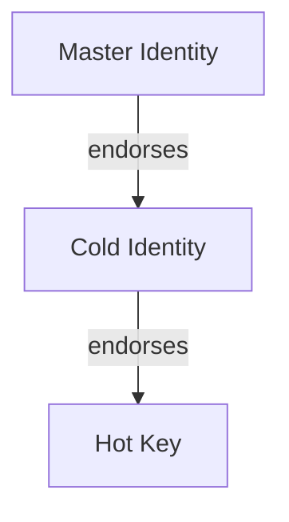

# EBP: Even Better Privacy


EBP is a self-declared successor to PGP, built from the ground up to be quantum-secure.

This repository contains the reference implementation of EBP. Its purpose is to demonstrate the architecture, protocols, and intended usage model of the system rather than to serve as a production-hardened security solution.

Project page: [williamdoyle.ca/ebp](https://williamdoyle.ca/ebp)

## Installation

All released application files will come with an EBP signature from [ebpdk1m6l96sg6xpwcspl5yn9zph8j82x7ujsuuwl5gwqhctgmndjtvvjq5vwp99](https://ebp-cqyo.onrender.com/api/v1/identity/ebpdk1m6l96sg6xpwcspl5yn9zph8j82x7ujsuuwl5gwqhctgmndjtvvjq5vwp99)

### For Linux

- Navigate to [the releases page](https://github.com/willpiam/even-better-privacy/releases)
- Locate the latest release and click the "Assets" dropdown
- Select the `.AppImage` file and download it
- Once downloaded, make sure it has permission to run as a program
- Double-click the downloaded file to launch the EBP program

### For Mac

- Navigate to [the releases page](https://github.com/willpiam/even-better-privacy/releases)
- Locate the latest release and click the "Assets" dropdown
- Select the `.dmg` file and download it
- Run the file, drag the image of the fox into the applications icon
- EBP is now installed on your mac and can be run like any other application

### For Windows

- Navigate to [the releases page](https://github.com/willpiam/even-better-privacy/releases)
- Locate the latest release and click the "Assets" dropdown
- Select and download the `.msi` file
- Run the `.msi` file and follow the wizard to install EBP on your system
- Launch EBP like any other windows program. It can be found by searching for "EBP"

### From Source (Linux, Windows, & Mac)

If you are comfortable with the CLI and or would like to contribute to this codebase you will likely want to run ebp from source. Even without experience using the CLI this should be pretty simple. This is likely the most reliable way to get EBP up and running on your system. 

1. Install [Deno](https://deno.land/)
2. Clone this repository
3. Run tests to verify everything works: `deno task test:core`

#### Quick Start (GUI + Public Server)

1. Run `deno task gui`
2. navigate to [http://localhost:8787](http://localhost:8787) (or wherever the terminal points you to) in your browser
3. click on settings
4. Set *server url* to https://ebp-cqyo.onrender.com

### Build locally

If you wish to create your own build file you should be able to do so fairly easily. 

- install Node + NPM, Rust + Cargo, and Deno
- run the shell script for your OS (`build_desktop_mac.sh`, `build_desktop_windows.sh`, or `build_desktop_linux.sh`)

If all goes well this should result in an executable file... EBP.AppImage on Linux, __ on Mac, or __ on Windows. 

## Native Email

The EBP GUI includes a built-in interface for sending and receiving email.
It connects directly over standard SMTP and IMAP protocols, making it compatible with most email providers. EBP also supports OAuth with Gmail and Outlook for a simpler experience.  

### Native Email Via OAuth

To run using OAuth you will need to provide the following values in your `.env` file. 

```ini
MAIL_OAUTH_GMAIL_CLIENT_ID=""
MAIL_OAUTH_GMAIL_CLIENT_SECRET="" # only provided to key server (playing double duty by also handeling oauth)

# MAIL_OAUTH_OUTLOOK_CLIENT_ID="" # no longer concerned with outlook because the headache wasn't worth the time
# MAIL_OAUTH_OUTLOOK_CLIENT_SECRET="" # only provided to key server, not the users machine
```

If you are using a testing gmail client oauth cred you may find this following link helpful for adding people as test users. [console.cloud.google.com/auth/audience](https://console.cloud.google.com/auth/audience). Make sure you are in the correct project. Scroll down to "Test users" and click "add users". 

### Proton Native Email

Proton users must install and run Proton Mail Bridge to use EBP Native Email.

### Testing Native Email

Add two test email accounts two the dotenv file in order to test email functionality in the e2e test suite. 

```ini
TEST_EMAIL_ONE=""
TEST_EMAIL_ONE_PWORD=""
TEST_EMAIL_ONE_SMTP_PORT="465"
TEST_EMAIL_ONE_SMTP_HOST=""
TEST_EMAIL_ONE_IMAP_PORT="993"
TEST_EMAIL_ONE_IMAP_HOST=""

TEST_EMAIL_TWO=""
TEST_EMAIL_TWO_PWORD=""
TEST_EMAIL_TWO_SMTP_PORT="465"
TEST_EMAIL_TWO_SMTP_HOST=""
TEST_EMAIL_TWO_IMAP_PORT="993"
TEST_EMAIL_TWO_IMAP_HOST=""
```

## Email Chrome Extension

EBP includes a Chrome extension that adds sign/encrypt and decrypt/verify
controls to webmail using the local GUI backend API.

Supported email clients (web):
- Gmail
- Outlook (Outlook on the web)
- Proton Mail

### Install The Extension

This extension will work on any chromium based browser. 

#### Install The Extension From Source

1. Open `chrome://extensions` or 
2. Enable Developer Mode.
3. Click **Load unpacked** and select this folder:
   `/even-better-privacy/email/chrome-extension`

~~See the extension guide in [`email/chrome-extension/README.md`](email/chrome-extension/README.md)~~

#### Install The Extension from the Chrome Webstore

I have not yet published the extension to the webstore. I intend to do this soon. 

## Environment Configuration

If you intend to run your own key server you will need to create a `.env` file in the project root (the same folder as this `ReadMe.md`). Example:

```ini
DB_TYPE=psql # options include sqlite | psql

# postgres database connection details
PG_HOST=localhost
PG_PORT=5432
PG_USER=postgres
PG_PASSWORD=postgres
PG_DATABASE=ebp
PG_POOL_SIZE=5

SMTP_HOST=smtp.example.com
SMTP_PORT=465
SMTP_USER=<sender email address>
SMTP_PASS="sender email password here"
SMTP_FROM=<sender email address>
SMTP_SECURE=true

PUBLIC_BASE_URL=<base url of ebp key server>
```

## Supported Crypto-Systems

EBP uses quantum secure schemes approved by NIST. More information on NISTs post quantum cryptography standards can be found [here](https://csrc.nist.gov/projects/post-quantum-cryptography)

### Signing

#### Hash Based

- SLH-DSA (SPHINCS+)

#### Lattice Based

- ML-DSA (Dilithium)
- FN-DSA (Falcon) (Planned)

### Encrypting

- ML-KEM (Kyber)

| Name                      | Varient Used      | Public Key Size   | Purpose  |
| --------------------------|-------------------|-------------------|----------|
| ML-KEM (Kyber)            | ML-KEM-1024       | 1,568 bytes       | KEM      |
| SLH-DSA (SPHINCS+)        | SLH-DSA SHA2-256s | 64 bytes          | Auth     |
| ML-DSA (Dilithium)        | ml_dsa87          | 2,592 bytes       | Auth     |
| FN-DSA (Falcon) (Planned) | NA                | NA                | Auth     |

## Scheme

Unlike RSA or ECC, the new post quantum schemes support either encryption or message signing but not both in the same scheme. Therefore we insist signing and encryption (or rather KEM) keys never appear in isolation but always come in pairs; a signing key and an encryption key. The resulting object is called an Identity. The fingerprint of an identity is the hash of the two keys. 

### A Note On KEMs

At the moment we treat KEMs like regular asymmetric encryption. When we send an encrypted message to an identity we always generate a fresh AES key and use it to encrypt the message, then we encapsulate the AES key with the recipients KEM key, then we send the encapsulated key along with the ciphertext to the recipient. Responses are encrypted with a new AES key, not the one initially provided by the first sender. 

I am open to changing this in the future. This approach has been easiest for me, and I don’t see changing it as a priority. It’s straightforward and versatile, but I do acknowledge it is less efficient than it could be.”

## How It Works

1. Generate an identity (creates a signing key + encryption key pair)
2. Share your public identity with others (fingerprint + public keys)
3. Import contacts' public identities
4. Sign messages — recipients verify using your public signing key
5. Encrypt messages — recipients decrypt using their private encryption key 

## Revocation System

EBP supports revocation of both details and entire identities. All revocations require a valid signature from the identity being revoked, ensuring that only the key holder can revoke their own data.

### Revocation Types

#### Detail Revocation
Remove a specific detail (like an email or name) from an identity. Use this when:
- Information has changed (new email address)
- Information was entered incorrectly
- You no longer want that information associated with your identity

```bash
# Revoke a detail locally
ebp revoke-detail email --reason "Changed email address"

# Revoke and push to server
ebp revoke-detail email --reason "Changed email address" --push
```

#### Identity Revocation
Mark an entire identity as compromised or invalid. **This is irreversible.** Use this when:
- Your private key has been compromised
- You're migrating to a new identity
- The identity should no longer be trusted

```bash
# Revoke identity (requires --force confirmation)
ebp revoke --reason "Key compromised" --force

# Revoke and push to server
ebp revoke --reason "Key compromised" --force --push
```

### Emergency Revocation Certificates

You can pre-generate an emergency revocation certificate when creating an identity. This certificate can be stored securely (e.g., printed and kept in a safe) and used later if your private key is compromised—even if you lose access to the key itself.

```bash
# Generate identity with emergency certificate
ebp generate --revocation-cert --revocation-output emergency-revoke.json

# Generate emergency certificate for existing identity
ebp generate-revocation-cert --output emergency-revoke.json
```

**Important**: Store emergency certificates securely. Anyone with this certificate can revoke your identity.

### How Revocations Work

1. **Signed Certificates**: Each revocation creates a signed certificate containing:
   - Type (detail or identity)
   - Identity fingerprint
   - Monotonically increasing nonce (prevents replay attacks)
   - Timestamp
   - Optional reason
   - Target path (for detail revocations)
   - Cryptographic signature

2. **Verification**: Anyone can verify a revocation certificate using the identity's public signing key. The server validates signatures before accepting revocations.

3. **Nonce Protection**: Revocation nonces must be strictly increasing, preventing attackers from replaying old revocation certificates. Emergency certificates use nonce 0 and can be used once.

4. **Server Integration**: When pushed to a server, revocations are stored and returned with identity queries. Clients should check revocation status when importing contacts.

### Checking Revocation Status

When fetching an identity from the server, the response includes:
- `revoked`: Boolean indicating if the identity is revoked
- `revocationCertificate`: The hex-encoded certificate if revoked
- `revokedDetails`: Array of detail paths that have been revoked

Applications should warn users when interacting with revoked identities or details.


## Tests

Run each of these to ensure everything is working

Core tests

    deno task test:core

CLI Tests

    deno task test:cli-utils

*More CLI tests could be useful*

Server tests

    deno task test:server

GUI backend tests

    deno task test:gui-backend

E2E GUI tests (Playwright)

    npm install
    npx playwright install --with-deps

In your `.env` file set 

```
    DB_TYPE=sqlite 
```

Then run the tests (this will auto-start the GUI local backend):

    deno task test:e2e

To run end to end tests using postgres for the database 

```
    DB_TYPE=psql
```

then run 

    deno task test:e2e:psql

## Fingerprint (Merkle Root + Bech32)

EBP fingerprints use:
- a merkle root of the two public keys (signing leaf + encryption leaf)
- bech32 encoding with signing-scheme specific HRPs

We use a merkle tree of the two keys as a fingerprint because it allows the fingerprint to be verified without both keys. This could be useful in cases where data costs are high and both keys are not required. 

Current prefixes:
- `ebpdk1...` for Dilithium + Kyber identities
- `ebpsk1...` for SPHINCS+ + Kyber identities

## CLI

**Note:** Where this section talks about a program called `ebp`, you will instead use `deno task cli`

The `ebp` CLI manages post-quantum identities and secure messaging. You can generate multiple identities (stored under `~/.ebp/<name>.identity.json`), switch between them, inspect fingerprints and details, exchange signed/encrypted messages with contacts, and encrypt/decrypt full file payloads.

- create and switch identities (`ebp generate [name]`, `ebp identities`, `ebp use <name>`)
- view identity info and attached details (`ebp info`, `ebp details`)
- export public identities for sharing (`ebp export-public`)
- import contacts and list them (`ebp import`, `ebp contacts`)
- sign messages (`ebp sign`) and verify (`ebp verify`)
- encrypt and decrypt for peers (`ebp encrypt`, `ebp decrypt`)
- encrypt and decrypt files (`ebp encrypt-file`, `ebp decrypt-file`)
- publish identities to the server and fetch contacts (`ebp server <url>`, `ebp publish`, `ebp fetch <fingerprint>`)
- push attached details to the server when adding them (`ebp detail <path> <value> --push`)

## GUI 

- All the features of the CLI but in a graphical format
- Interfaces with the same file system — the GUI and CLI are two interfaces to the same data

### How to Run the GUI

1. Run the local backend: `deno task gui:local-backend`
2. Navigate to [localhost:8787](http://localhost:8787/) 


## Support Development

If you find EBP useful, consider supporting the project:

| Network | Address/Handle | Link |
| --- | --- | --- |
| Ethereum (& more) | `williamdoyle.eth` | https://app.ens.domains/williamdoyle.eth |
| Bitcoin | `bc1q6crw4wy7jecs05f4ytz68n6evuzlu7k3cnu7zy` | https://blockchair.com/bitcoin/address/bc1q6crw4wy7jecs05f4ytz68n6evuzlu7k3cnu7zy |
| Cardano | `$wildoy` | https://handle.me/wildoy |
| QRL | `Q02070028dc6ca5f722f9646171cee25eff5d178907d0e05a7c343eeba77ef138fcc0da9a0074db` | https://explorer.theqrl.org/a/Q02070028dc6ca5f722f9646171cee25eff5d178907d0e05a7c343eeba77ef138fcc0da9a0074db |

## Privacy

See [PRIVACY.md](PRIVACY.md) for the project privacy policy.

## License

MIT — see [LICENSE](LICENSE) for details.

## Upcomming Features

- ENS Support
    - Add support for EBP fingerprints to ENS. This means contributing a small bit of code to the ENS project. I've already tried to do this with QRL but my pull request was never merged. https://github.com/ensdomains/address-encoder/pull/386 . This step is not required to make the system work well with ENS but it will make it a bit nicer for the user. Infact this could be a last step. 
    - Add support for searching ENS names for EBP fingerprints. Then look up the fingerprint on the EBP server
    - Add a provision so that a user can add an ENS name to their EBP identity as a detail but the server must check that the users fingerprint has already been added to the ENS name
- Better db interface layer
    - abstract on EBP actions instead of the db connection
    - this will allow us to have different SQL for the sqlite and psql implementations. It would also allow use to easily implement non-sql connections. 
- end to end tests for the email plugin 
- email: enable ebp interface when a user directly replies to an email
- email: select multiple recipients. Encrypt with same AES key. Send json object with one encrypted message and an object mapping the recipients fingerprint to a copy of the AES key encapsulated just for that recipient. 

```json
{
    "encapsulated_key_map": {
        "<recipient fingerprint>": "<ciphertext>"
    }, 
    "ciphertext":"<AES ciphertext of M + Sm, where M is a message and Sm is a signature on that message>"
}
```
- Support expiry dates for identities
- Endorse other EBP identities as your own (two-way binding)
- plugin: Make it harder to accidentally send email without first encrypting
- plugin: hide password inputs
- hashed details
    - hashed email endorsement
        - take hash of your email address
        - sign hash
        - send hash & email address & signature to public key server
        - server sends email for you to confirm your email
        - server never makes unhashed email public. Perhaps even deletes raw email address after the user has confirmed it. 
        - users who receive signed emails from you can still confrim that the email address is associated with the provided EBP identity. 
        - reduce your exposure to spam
- Support identity hierarchy
    - parent can revoke the relationship
    - one pattern might look like this:


- when adding a detail to an identity I want to take the input to a details path as a drop down with the first option being "custom" so users can provide thair own details path
- tighten up `core`
- tighten up `gui/local-backend`
- create full inventory and plan for hardening
- mobile application
    - full feature parity with GUI
- advanced email features
    - search the inbox
    - write and save drafts (encrypted with the same pin/password)
    - render emails: images, layout, font, everything
        - what is usually used? HTML? Markdown?
    - scheduled send
    - more traditional "email inbox" layout for the email page
- 


## Questions & Answers

**Do you support Hybrid crypto**

No. EBP is not intended as a transitory protocol. 