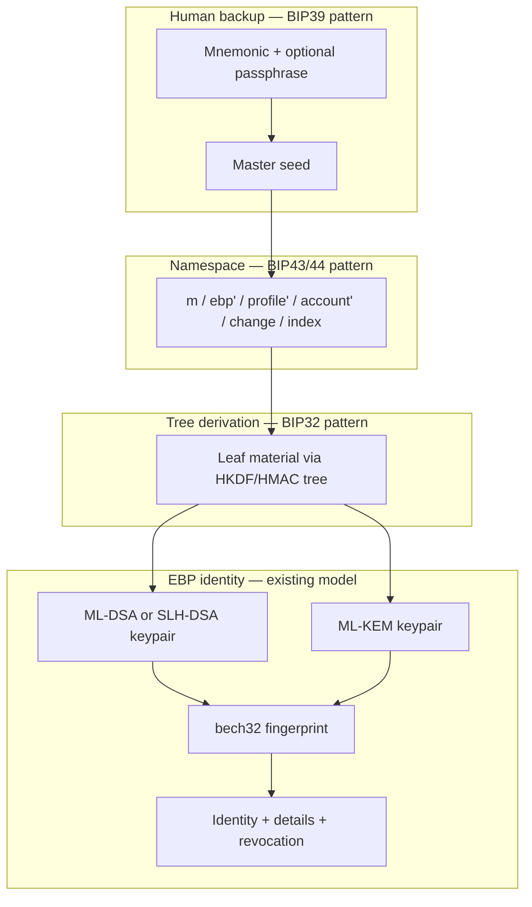

# BIP HD Patterns Applied to EBP

## Summary

Bitcoin BIPs 32, 39, 43, and 44 define hierarchical key derivation, mnemonic backup, derivation namespaces, and multi-account path layouts. Their structure is largely **cryptography-agnostic**; Bitcoin binds them to secp256k1. EBP could adopt the same **structural** patterns while keeping leaf cryptography as dual post-quantum identities (signing + ML-KEM per [[identity-model]]). EBP does **not** implement these BIPs today; this page records how each could apply and what advantage adoption would bring.

See [[source-bip-hd-wallet-standards]] for raw BIP summaries and [[key-management]] for how they relate to EBP lifecycle framing.

## Cross-cutting model



| BIP | Primary EBP benefit |
|---|---|
| **32** | One root → many PQ identities; least-privilege public derivation |
| **39** | Checksummed paper backup and cross-device recovery of that root |
| **43** | Unambiguous EBP derivation namespace, extensible by purpose |
| **44** | Multi-persona layout, external/internal split, discovery + gap limits |

**Composition with existing EBP features:** Signed identity **hierarchy** ([[component-server]] hierarchy certificates) expresses *trust delegation between independent identities*. HD BIPs would add *deterministic generation and backup from one seed*. The two layers compose: derive cold/warm/hot identities from one mnemonic, then publish hierarchy certificates stating which derived identity may act for which.

---

## BIP 32 — Hierarchical Deterministic Keys

### How it could apply

Define an EBP-specific HD scheme: one CSPRNG master seed expands via HMAC/HKDF into a tree where each **leaf** yields a full signing + encryption keypair (ML-DSA or SLH-DSA + ML-KEM). Each leaf is a normal EBP identity with its own bech32 fingerprint — not a sub-fingerprint of the parent.

Natural mappings:

- **Persona tree** — one backup → many identities (personal, work, project-specific).
- **Cold / warm / hot chains** — aligns with roadmap "identity hierarchy (master → cold → hot key chains)" in [[overview]]; derivation supplies keys; hierarchy certificates express trust relationships.
- **Hardened vs non-hardened** — hardened branch for signing-capable identities; non-hardened branch could allow deriving **future public identities** for sync/display servers without exporting signing keys (see xpub leakage discussion in [[source-bip-hd-wallet-standards]]).

### Advantage for EBP

- **One backup, many identities** instead of N separate `~/.ebp/*.identity.json` files and N independent recovery flows.
- **Least-privilege deployment** — GUI, [[component-email-extension]], or server sync could hold derive-public-only capability while signing keys stay on a cold device ([[key-management]]).
- **Operational rotation** — derive a new hot identity, publish it, revoke the old one via [[revocation-system]], without changing the root backup.

### EBP-specific requirements

- Derivation must atomically produce **both** keys per leaf and feed existing fingerprint construction (`computeSigningLeafRaw` + `computeEncryptionLeafRaw` in `core/Fingerprint.ts`).
- Bitcoin `CKDpriv` / `CKDpub` math cannot be reused; EBP needs a specified PQ KDF profile (HKDF labels, domain separation, hardened index semantics).

---

## BIP 39 — Mnemonic Code for Deterministic Keys

### How it could apply

Use BIP39 (or an EBP variant with the same UX properties) to encode the **master seed for the HD tree**, not raw PQ key bytes. Flow: CSPRNG entropy → checksum mnemonic → PBKDF2-stretched seed → EBP HD derivation → generate leaf identities.

This sits **above** today's storage model ([[identity-model]]): password + AES encryption of private keys in identity JSON, with PBKDF2 for the storage KDF (see April 2026 audit notes on iteration counts in [[security-audit-2026-04/phase-02-crypto-core]]). The mnemonic recovers the **root**; per-identity password encryption may remain unless storage is redesigned.

### Advantage for EBP

- **Human paper backup** with checksum — users verify they wrote the phrase correctly before losing access.
- **Cross-device recovery** without transferring encrypted JSON — valuable for [[component-mobile]] and [[component-gui]] parity.
- **Anti-brainwallet semantics** — BIP39 encodes CSPRNG entropy, not user-chosen phrases ([[source-bip-hd-wallet-standards]]).
- **Optional passphrase** — same seed + different passphrase → different valid tree (deniability or security-tier separation).

### EBP-specific requirements

- Mnemonics recover a **seed**, not PQ private key blobs (keys are too large for word encoding).
- English wordlist vs EBP-specific list is a product choice; deployed wallet ecosystem is English-centric per BIP39.

---

## BIP 43 — Purpose Field for Deterministic Wallets

### How it could apply

Reserve a first-level hardened **EBP purpose constant** (dedicated SLIP/BIP number, not Bitcoin `44'`) so every EBP client agrees on tree shape. Sub-purpose levels could mirror existing signature domains (`message`, `detail-proof`, `revocation`, `hierarchy` in `core/MessageHash.ts`) or future material such as [[analysis-shared-key-concept]] symmetric roots — each gets a documented namespace.

Example conceptual layout:

```
m / ebp' / <sub-purpose>' / ...
```

where `<sub-purpose>` distinguishes identity derivation, shared-key root derivation, emergency-revocation material, etc.

### Advantage for EBP

- **Interop without silent forks** — "EBP HD-compatible" means a documented path, not ad-hoc KDF labels.
- **Separation from Bitcoin** — EBP paths never collide with `m/44'/0'/...` even if users reuse backup habits.
- **Extensibility** — new features get reserved purpose ranges instead of overloading identity derivation.

### EBP-specific requirements

- BIP43 solves **namespace documentation**, not cryptography; EBP still needs a spec for what each purpose level means and what a leaf contains.

---

## BIP 44 — Multi-Account Hierarchy

### How it could apply

Adapt the BIP44 path template to EBP semantics:

| BIP44 level | Possible EBP meaning |
|---|---|
| `purpose'` | EBP namespace (BIP43) |
| `coin_type'` → **profile'** | Signing profile (`dilithium`, `sphincs`) or mixed policy |
| `account'` | User-facing persona / org account |
| `change` | **External** (published on server, in contacts) vs **internal** (recovery-only, emergency, device-local) |
| `address_index` | Sequential slot for derived identities within that account |

Import/sync can use BIP44's **account discovery** and **gap limit** (default 20) to scan which derived identities were actually published on [[component-server]] ([[source-bip-hd-wallet-standards]]).

### Advantage for EBP

- **Organized multi-identity UX** — "work account, slot 3" instead of opaque fingerprint lists.
- **Safer import/sync** — gap-limited scanning answers how many unused derived identities to check ([[component-cli]], [[component-gui]]).
- **Published vs private separation** — external chain = shared identities; internal chain = never-published backup/emergency identities.
- **Account-level lifecycle** — rotate or revoke a subtree without touching other personas (via [[revocation-system]] per identity).

### EBP-specific requirements

- Each derived slot is a **new first-class identity** (new fingerprint, new revocation trail, contact updates) — BIP44 structure helps **generation and discovery**, not in-place mutation of an existing fingerprint.

---

## What EBP already has

| Mechanism | Role today |
|---|---|
| Single identity per file | Dual PQ keypair + fingerprint in `~/.ebp/<name>.identity.json` |
| Password + PBKDF2 | Encrypts private keys at rest (storage KDF, not identity tree root) |
| Hierarchy certificates | Signed parent/child **trust** relationships on server — not deterministic derivation from one seed |
| Roadmap | "Identity hierarchy (master → cold → hot key chains)" in [[overview]] — HD BIPs are one way to implement the key-generation side |

---

## Open design questions

- Should EBP reuse BIP39 wordlists and PBKDF2 parameters for the master seed, or define `ebp-mnemonic-v1` with PQ-appropriate iteration counts?
- Per-message vs per-identity: should [[analysis-shared-key-concept]] roots live on a separate BIP43 purpose branch from identity leaves?
- How do HD-derived identities interact with [[revocation-system]] emergency certificates pre-generated at the root?
- FN-DSA ([[fn-dsa]]) profile slots: new `profile'` values vs new purpose constants?

---

## Related pages

- [[source-bip-hd-wallet-standards]]
- [[key-management]]
- [[identity-model]]
- [[overview]]
- [[revocation-system]]
- [[analysis-shared-key-concept]]
- [[component-server]]
- [[component-cli]]
- [[component-gui]]
- [[component-mobile]]

## Sources

- `wiki/raw/bip-0032.mediawiki`, `bip-0039.mediawiki`, `bip-0043.mediawiki`, `bip-0044.mediawiki` → [[source-bip-hd-wallet-standards]]
- `core/Fingerprint.ts`, `core/Identity.ts`, `core/MessageHash.ts`
- [[identity-model]], [[key-management]], [[overview]]
