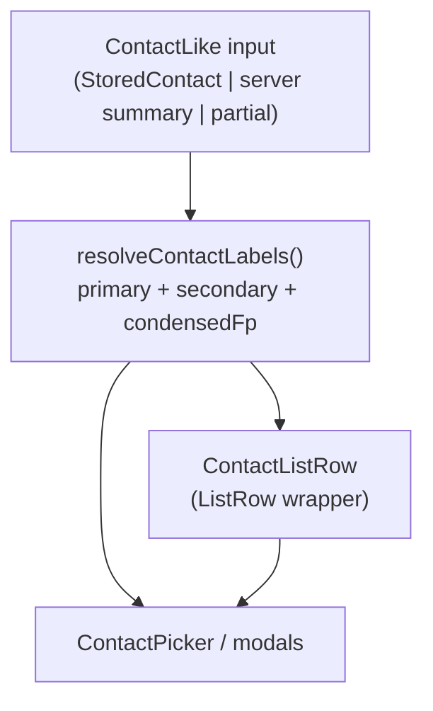

# Mobile Contact Display Component

Design note for a shared contact **label + row** layer on [[component-mobile]], so Encrypt Message and other pickers show people, not opaque storage names / full fingerprints.

## Implementation status (2026-07-22)

Shipped on [[component-mobile]]:

- `mobile/src/services/contactDisplay.ts` — `condenseFingerprint` (12…12),
  `resolveContactLabels`, `contactSearchHaystack`, adapters
- `mobile/src/components/ContactListRow.tsx`
- Wired: `ContactPicker`, `ContactsScreen`, `RecipientResolveModal`,
  `BrowseContactsModal`
- Jest: `mobile/__tests__/contactDisplay-test.ts`

## Verdict (pre-ship)

There was **no** single reusable contact display component. Friendly two-line labels existed only as local helpers on the Contacts list. `ContactPicker` and `RecipientResolveModal` rendered storage `name` + full fingerprint — which is why Encrypt Message looked anonymous when `name` is an auto stub (`fingerprint.slice(0, 16)`).

## Current inventory

| Surface | File | What it shows today | Needs shared labels? |
|---------|------|---------------------|----------------------|
| Encrypt Message recipient | `ContactPicker` (search) via `EncryptMessageScreen` | `item.name` + full fingerprint | **Yes — primary pain** |
| Encrypt File recipient | same | same | **Yes** |
| Mail compose EBP contact | `ContactPicker` (dropdown) ×3 in `MailComposeScreen` | same | **Yes** |
| Contacts local list | `ContactsScreen` + `ListRow` | local helpers: alias → published `name` → non-stub storage name → truncate(8…4); subtitle email / truncate | **Yes** (replace helpers; align priority + 12…12) |
| Compose resolve modal | `RecipientResolveModal` | `item.name` + full fingerprint | **Yes** |
| Browse server identities | `BrowseContactsModal` + `ListRow` | published `name` or truncate(8…4); subtitle email · key types · created | **Partial** — use shared primary/secondary; keep extra directory meta as optional third line / `meta` |
| Contact detail header | `ContactDetailScreen` | Alias line + full fingerprint | Optional compact summary; full fp still appropriate for copy/verify |
| Sender authenticity | `MailSenderAuthenticityScreen` | Field rows (email / opaque / endorsement) | Low priority; may use primary label if a local contact is resolved |
| Identities home | `IdentitiesHomeScreen` | Identity **name** + scheme · truncate | **Out of scope** — wallet identities, not contacts |

`ListRow` is a generic chrome primitive (avatar / title / subtitle / badge / right). It is not contact-aware. `ContactPicker` is a selection control that should **consume** shared labels, not redefine them.

## Proposed display rules

Canonical two-line labels for a contact-like record:

1. **Primary** (first non-empty): `localAlias` → published `name` detail → published `email` detail (or resolved `opaque::email`) → condensed fingerprint.
2. **Secondary**: email (published or resolved opaque) **if present and not already used as primary**; otherwise condensed fingerprint.
3. **Condensed fingerprint**: first 12 + `…` + last 12 characters (if shorter than 25 chars, show full fingerprint).

Email for display should prefer cleartext published `email`, else `resolvedOpaqueDetails['opaque::email']` — same idea as today’s Contacts subtitle ([[identity-model]], [[analysis-mobile-compose-recipient-resolve]]).

### Delta vs current ContactsScreen helpers

- Contacts list currently also prefers storage `name` when it is not the auto stub `fingerprint.slice(0, 16)`. The rules above **omit** storage `name` as a display signal (it is an opaque filename / import handle). Selection value can remain storage `name`.
- Truncation today is `8…4`; target is `12…12`.

## Design for flexibility (three layers)

Keep label math, row chrome, and picker behavior separate so every surface can reuse the same people-readable strings without forcing one UI shell.

### 1. Pure resolver (shared, no RN)

- Module e.g. `mobile/src/services/contactDisplay.ts` (or next to `contacts.ts`).
- Input: a small `ContactLike` shape:

  - `fingerprint: string` (required)
  - `localAlias?: string`
  - `details?:` details map (for `getDetailValue(..., 'name'|'email')`)
  - `resolvedOpaqueEmail?: string`
  - optional: no dependency on storage `name`

- Output: `{ primary, secondary, condensedFingerprint, emailUsedAsPrimary }`.
- Also export `condenseFingerprint(fp)` and a **search haystack** builder (alias, name detail, email, opaque email, fingerprint, optionally storage name for matching only).

Adapters:

- `StoredContact` → `ContactLike`
- `ServerIdentitySummary` → `ContactLike` (no alias)
- Authenticity / partial → fingerprint + whatever details are known

### 2. Presentational row

- `ContactListRow` wrapping `ListRow`: maps `primary`/`secondary` → title/subtitle; avatar from primary.
- Props for flexibility:
  - `onPress`, `showChevron`, `selected`, `badge`, `right` (Browse Import button)
  - `subtitleOverride` or `extraSubtitle` for directory meta (key types · created)
  - `dense` / no-avatar for picker dropdowns if ListRow feels heavy
  - never invent selection semantics here

### 3. Selection chrome stays in ContactPicker

- Keep variants `search` | `dropdown`.
- Selected **value** remains storage `name` (crypto/mail APIs already key on it).
- Trigger and list items render via resolver (or `ContactListRow`).
- Filter with the shared haystack so typing an alias or email finds the row.
- Optional later: decrypt/verify free-text sender fields could adopt the same search dropdown (GUI already has multi-field contact search in `gui/js/contact-search.js`).

## Adoption order (suggested)

1. Extract resolver + `12…12` helper; unit-test priority edge cases (alias only; name only; email-as-primary; email+fingerprint secondary; short fp).
2. Wire `ContactPicker` (fixes Encrypt Message / Encrypt File / Mail compose immediately).
3. Replace ContactsScreen local helpers; align Browse primary line; fix RecipientResolveModal.
4. Optionally polish Contact Detail header and authenticity summary title.

## GUI note

Desktop contact search shows storage name + alias + detail chips + short fingerprint (`gui/js/contact-search.js`). Mobile need not pixel-match GUI, but should stop being strictly worse on human-readable identity. A later parity pass could share the same priority rules in both clients.

## Related

- [[component-mobile]]
- [[identity-model]]
- [[analysis-mobile-compose-recipient-resolve]]
- [[analysis-gui-mobile-parity-deltas]]
- [[analysis-opaque-detail-endorsement]]

## Sources

- `mobile/src/components/ContactPicker.tsx`
- `mobile/src/screens/ContactsScreen.tsx`
- `mobile/src/components/RecipientResolveModal.tsx`
- `mobile/src/components/BrowseContactsModal.tsx`
- `mobile/src/screens/mail/MailComposeScreen.tsx`
- `gui/js/contact-search.js`
