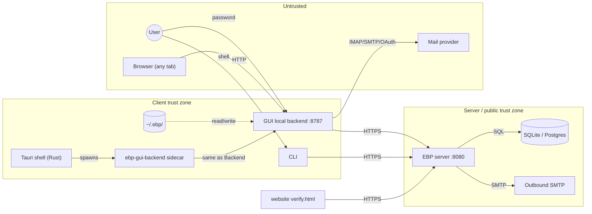

# EBP Threat Model

Per-component STRIDE table, adversary capability matrix, and trust-boundary
diagram for the April 2026 [[README|EBP Security Audit]].

## Assets

| ID  | Asset                                                              | Why it matters                                                                                                                       |
| --- | ------------------------------------------------------------------ | ------------------------------------------------------------------------------------------------------------------------------------ |
| A1  | Private signing keys (Dilithium / SPHINCS+)                        | Compromise enables full identity impersonation, retroactive forgery of detail proofs, hierarchy claims, and revocations.             |
| A2  | Private KEM keys (ML-KEM-1024)                                     | Compromise enables decryption of all messages encrypted to the identity (no forward secrecy in current design).                      |
| A3  | AES-encrypted private-key blob (`encrypted` field of v2 storage)   | Recovery of A1/A2 via offline brute-force if password is weak.                                                                       |
| A4  | Local identity password                                            | Used to derive the AES key over A3. Memory and prompt hygiene matters.                                                               |
| A5  | Emergency revocation certificate                                   | Anyone holding it can revoke the identity.                                                                                           |
| A6  | Public identity index on the server (fingerprint → keys + details) | Integrity is the single point of trust for newcomers fetching contacts.                                                              |
| A7  | Detail proofs and detail values (incl. opaque hashes)              | Privacy / linkability of an identity to real-world identifiers.                                                                      |
| A8  | Revocation state (per-identity, per-detail)                        | Liveness of trust signals; suppression yields long-lived compromised identities.                                                     |
| A9  | Hierarchy certificates                                             | Establish master/cold/hot key relationships; misuse enables identity-graph confusion.                                                |
| A10 | OAuth refresh tokens (Gmail/Outlook proxy)                         | Long-lived mailbox access.                                                                                                           |
| A11 | Server database (SQLite/Postgres)                                  | Aggregate of A6–A10 plus rate-limit state.                                                                                           |
| A12 | GUI backend localhost socket (`127.0.0.1:8787`)                    | Ambient authority on the user's machine; any local origin can call it.                                                               |
| A13 | Distribution binaries (AppImage, DMG, MSI, Deno-compiled sidecar)  | Trust root for end-users.                                                                                                            |
| A14 | Source tree + lockfiles                                            | Supply-chain integrity.                                                                                                              |
| A15 | EBP-HD mnemonic + optional passphrase                              | Recovery root for every derived identity in an HD tree; compromise enables regeneration of all derived signing and KEM private keys. |
| A16 | EBP-HD derivation path metadata (`hdProvenance`)                   | Not secret by itself, but can reveal account/profile structure and aid correlation if over-shared.                                   |

## Adversary capability matrix

| Adversary                                                       | Network | Local code exec | Server admin | Disk read of `~/.ebp/` | Browser tab on user machine | Compromised dependency | Notes                                                                            |
| --------------------------------------------------------------- | ------- | --------------- | ------------ | ---------------------- | --------------------------- | ---------------------- | -------------------------------------------------------------------------------- |
| Adv-Net (passive eavesdropper)                                  | yes     | no              | no           | no                     | no                          | no                     | TLS termination at server.                                                       |
| Adv-MITM (active in path)                                       | yes     | no              | no           | no                     | no                          | no                     | Can drop, replay, replace TLS connections (e.g. captive portal).                 |
| Adv-Server (malicious operator or compromised host)             | yes     | no              | yes          | no                     | no                          | no                     | Trusted only for storage / discovery, NOT for cryptographic verification.        |
| Adv-Local-Web (drive-by JS in any tab)                          | yes     | no              | no           | no                     | yes                         | no                     | Most relevant for the GUI local backend.                                         |
| Adv-Local-Proc (unprivileged co-tenant process)                 | yes     | yes (low priv)  | no           | yes (same UID)         | yes                         | no                     | Can read identity files at rest.                                                 |
| Adv-Disk (lost laptop / forensic image)                         | no      | no              | no           | yes                    | no                          | no                     | Pure offline; success depends on KDF + password.                                 |
| Adv-Mnemonic (paper-backup thief / shoulder surfer)             | no      | no              | no           | no                     | no                          | no                     | Can regenerate HD-derived identities if they obtain the mnemonic and passphrase. |
| Adv-Contact (someone you import)                                | yes     | no              | no           | no                     | no                          | no                     | Crafts malicious payloads, public identities, hierarchy proposals.               |
| Adv-Supply (compromised npm/jsr/crates package or Deno std URL) | n/a     | n/a             | n/a          | n/a                    | n/a                         | yes                    | Worst case: silently exfiltrate keys at sign/decrypt time.                       |
| Adv-Update (compromised release channel / GitHub)               | yes     | n/a             | n/a          | n/a                    | n/a                         | n/a                    | No verified update mechanism noted; users pull AppImage manually.                |

## Trust boundaries

Boundaries that matter most:

- B1: Browser ↔ local backend on `127.0.0.1:8787`. Any web origin can fetch
  this. CSRF, DNS rebinding, drive-by exploitation must be prevented.
- B2: Local backend ↔ disk. Backend has the user's full filesystem authority via
  `--allow-read --allow-write`.
- B3: CLI / GUI / verifier ↔ server. Server must be treated as untrusted for
  cryptographic verification.
- B4: Server ↔ Internet. Public attack surface, rate-limit and parser hardening
  matter.
- B5: Tauri shell ↔ sidecar. Loader page polls health endpoint then redirects;
  race / impersonation surface.
- B6: User ↔ EBP-HD mnemonic display/entry surfaces. The mnemonic is a master
  recovery secret and must not be logged, sent to the server, or persisted by
  GUI/mobile onboarding.

## STRIDE per component

### Crypto core (`core/`)

| Threat              | Concern                                                                                                                                      | Status                |
| ------------------- | -------------------------------------------------------------------------------------------------------------------------------------------- | --------------------- |
| S — Spoofing        | Cross-protocol signature confusion (same envelope reused for messages, detail proofs, revocations, hierarchy)                                | needs investigation   |
| T — Tampering       | Detail-proof / revocation-cert payload reconstructed from JSON on verify; canonicalization differences could break or be exploited           | needs investigation   |
| R — Repudiation     | Surreptitious forwarding (Davis 2001) on `signAndEncryptFor` — sender not bound to recipient inside the inner blob                           | confirmed flaw        |
| I — Info disclosure | Public-only identity created via `Object.create(Identity.prototype)` — secret keys are zero-length but error path may not be obvious         | low risk              |
| D — DoS             | Hex/base64 decode of attacker-supplied opaque bytes; no upper bound on input length in many helpers                                          | needs investigation   |
| E — Elevation       | Emergency revocation cert nonce-0 collides with first regular revocation nonce-0 — user's first revoke silently consumes emergency-cert slot | confirmed design flaw |

### Server (`server/`)

| Threat | Concern                                                                                                                                                                        |
| ------ | ------------------------------------------------------------------------------------------------------------------------------------------------------------------------------ |
| S      | Identity registration trusts client-supplied state signature; if state-hash canonicalization differs between client and server, signature checks may pass on substituted data. |
| T      | Mutation handlers (publish, detail, revoke, hierarchy) — must re-verify EVERY detail proof on POST `/identity`, not just shape.                                                |
| R      | OAuth flows; token persistence; missing audit trail.                                                                                                                           |
| I      | Error messages, version banner, search endpoint disclosure.                                                                                                                    |
| D      | Rate limiter bypass via `X-Forwarded-For`; JSON depth, key count, gzip-bomb on body.                                                                                           |
| E      | Hierarchy propose/accept/reject — IDOR if `/hierarchy/pending/:fingerprint` returns proposals without proving the caller is the target.                                        |

### GUI local backend (`gui/local-backend/`)

| Threat | Concern                                                                           |
| ------ | --------------------------------------------------------------------------------- |
| S      | No browser origin authentication — Host-header / Origin-header validation needed. |
| T      | `POST /api/v1/save-file` — path traversal, symlink, overwrite.                    |
| R      | No audit log of dangerous operations (sign with key, export, etc.).               |
| I      | Toast disclosing absolute paths under `$HOME`.                                    |
| D      | Mailparser / IMAP DoS; large file uploads.                                        |
| E      | `--allow-run`: which subprocesses, with what arguments? Argument-injection.       |

### Desktop / Tauri (`desktop/src-tauri/`)

| Threat | Concern                                                                                                                                      |
| ------ | -------------------------------------------------------------------------------------------------------------------------------------------- |
| S      | Loader-page polls `127.0.0.1:8787/health` then redirects — a malicious local server can race the legitimate sidecar and serve a phishing UI. |
| T      | `tauri.allowlist.shell.open=true` — links handled by the shell can be `file://`, custom schemes, etc.                                        |
| I      | Webview content from localhost — no CSP enforced by default.                                                                                 |
| E      | External binary `bin/ebp-gui-backend` not pinned by hash.                                                                                    |

### CLI (`cli/`)

| Threat | Concern                                                                     |
| ------ | --------------------------------------------------------------------------- |
| S      | Server URL persisted to disk — file in `~/.ebp/` could redirect operations. |
| T      | TOCTOU on file-path arguments.                                              |
| I      | Password prompt — terminal echo, scrollback, env-var fallback.              |
| D      | Large file inputs to `encrypt-file`.                                        |
| E      | None obvious.                                                               |

### Website verifier (`website/`)

| Threat | Concern                                                                             |
| ------ | ----------------------------------------------------------------------------------- |
| S      | Default server hardcoded to a Render hostname — supply-chain risk if domain lapses. |
| T      | Public identity JSON paste — JSON-bomb / prototype-pollution via `JSON.parse`.      |
| I      | Loads images from `raw.githubusercontent.com` — third-party content trust.          |

## Out-of-scope (this audit)

- `mobile/` — explicitly excluded.
- `email/chrome-extension/` — explicitly excluded; the localhost API it consumes
  IS in scope.
- Hardware side-channels on the user's machine (not within audit budget).
- Cryptanalysis of ML-KEM, ML-DSA, SLH-DSA themselves — assumed sound per FIPS
  203/204/205.

## Related Pages

- [[README]]
- [[findings]]
- [[../identity-model]]
- [[../revocation-system]]
- [[../message-payload-formats]]
- [[../component-server]]
- [[../component-gui]]
- [[../component-cli]]
